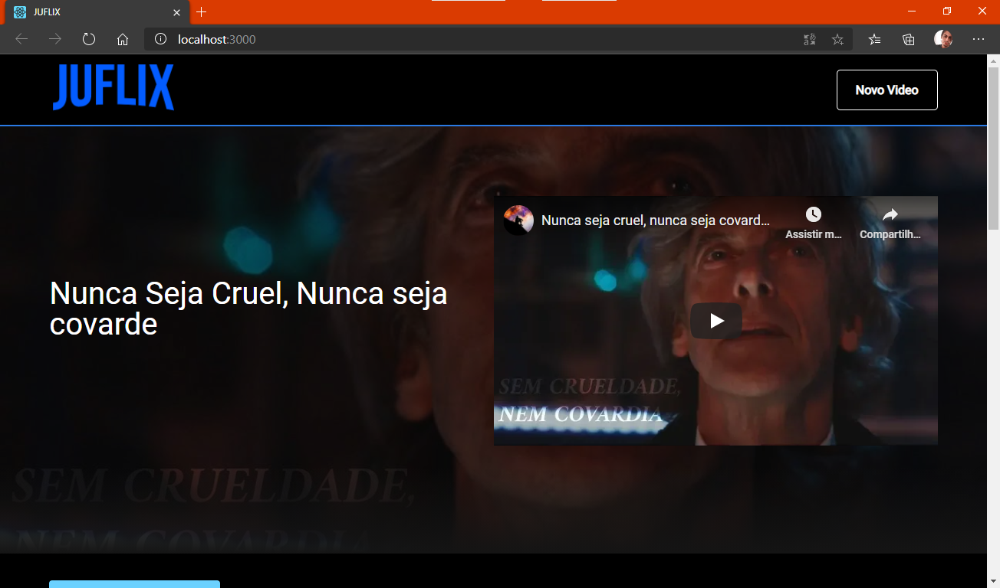
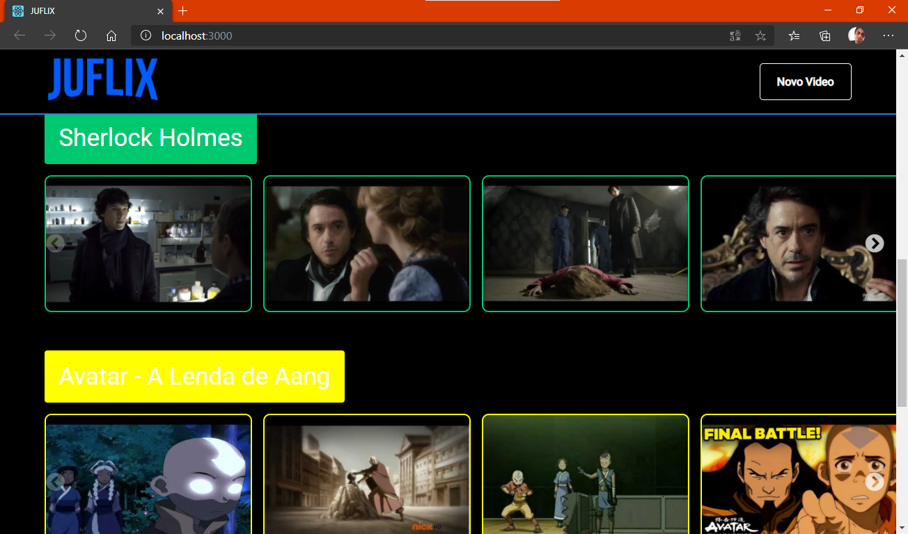
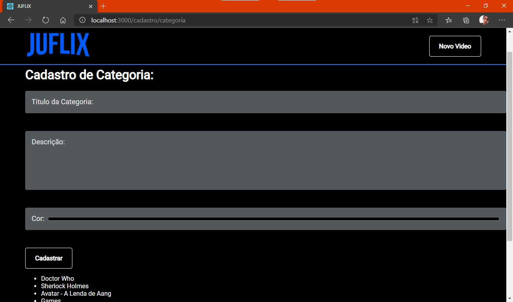
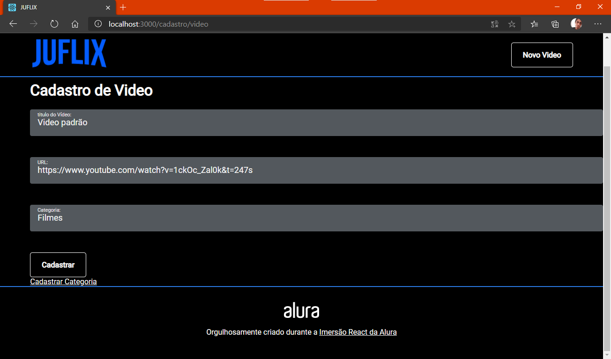

<h1 align='center'>JuFlix - #ImersãoReact</h1>

<h3>🔖 Descrição</h3>

Projeto desenvolvido na semana da #ImersãoReact da Alura.

<h3>🚀 Tecnologias</h3>
<ul>
    <li><a href="https://reactjs.org/" target="_blank">React</a></li>
    <li><a href="https://reactrouter.com/" target="_blank">React Route</a></li>
</ul>

<h3>ℹ️ Como usar</h3>

    # Clone esse repositório
    $ git clone https://github.com/juvenalbruno/Imersao_React_Juflix
    
    # Instalar dependências do projeto
    $ npm install
    
    # Executar o comando para rodar o projeto
    $ npm start

<h3>🖼 Layout</h3>
<h4>Janela inicial</h4>

 
<h4>Janela inicial</h4>

 
<h4>Janela de cadastro de Categorias</h4>

 
<h4>Janela de cadastro de Video</h4>

